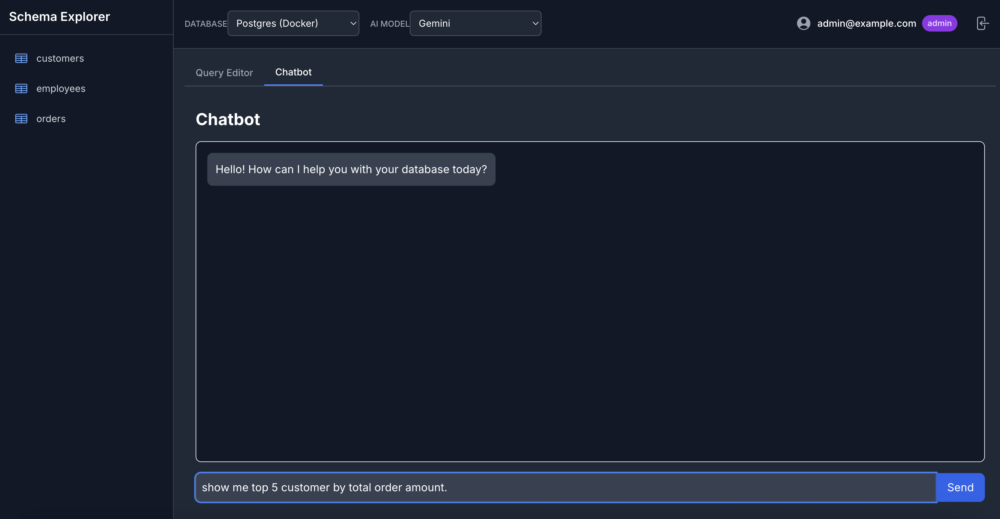
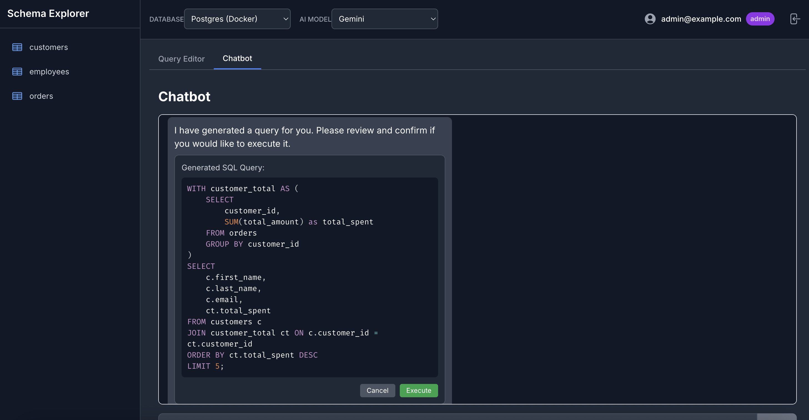
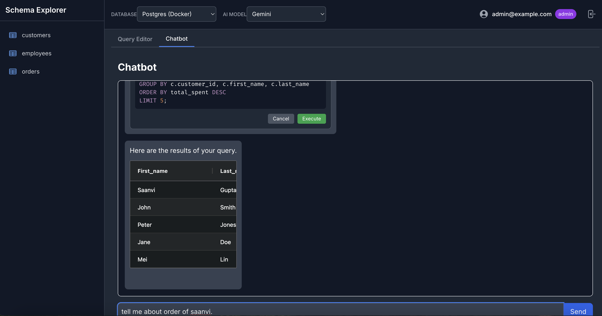

# MCP No-Code DB Tool

MCP No-Code DB is a modern, web-based database tool that allows users to connect to their database and interact with it using either natural language or raw queries. It leverages Large Language Models (LLMs) like Google's Gemini to translate plain English questions into executable SQL queries, providing a powerful and intuitive interface for data exploration.

While the platform is designed to be a **M**ulti-**C**onnection **P**latform, the current version is focused on providing a best-in-class experience for **PostgreSQL**.

---

## 📸 How It Works: A Visual Walkthrough

See the application in action in three simple steps.

### Step 1: Ask a Question in Natural Language
The workflow begins by asking a question about your data in plain English. The UI is designed to be simple and intuitive. After typing your question, you click "Generate Query" to have the AI process your request.




### Step 2: Review the AI-Generated SQL
The application uses the selected LLM to translate your question into a precise SQL query. The UI automatically switches to the "Raw Query" tab, displaying the generated SQL for your review and approval. This ensures you have full control and can verify the query before it runs.




### Step 3: Execute and View the Results
With the generated query confirmed, you click "Execute." The backend runs the query against your database, and the results are instantly displayed in a clean, interactive, and paginated table in the results panel below.




---

## ✨ Features

*   **Database Connectivity:** Connect seamlessly to your **PostgreSQL** database. The architecture is designed to be extended to other engines like MongoDB and Redis in the future.
*   **Dual Query Modes:**
    *   **Natural Language Query:** Ask questions in plain English and have an AI generate the SQL query for you.
    *   **Raw Query Editor:** A powerful editor with SQL syntax highlighting for writing and executing queries directly.
*   **AI-Powered:** Integrated with Google Gemini and OpenAI (ChatGPT) to power the natural language-to-SQL functionality.
*   **Schema Explorer:** Automatically discovers and displays the tables and columns of the connected PostgreSQL database.
*   **Secure by Default:**
    *   JWT-based authentication for secure user sessions.
    *   Role-Based Access Control (RBAC), with the first registered user becoming an `admin`.
    *   Read-only operations by default to prevent accidental data mutations.
*   **Interactive Results:** View query results in a sortable, paginated data table.
*   **Comprehensive Auditing:** All query generations and executions are logged for security and review.

---

## 💻 Tech Stack

This project is a modern full-stack application built with:

*   **Backend:**
    *   **Framework:** **Python 3.13+** with **FastAPI**
    *   **Validation:** **Pydantic**
    *   **Authentication:** **Passlib** and **python-jose**
    *   **Database Driver:** `psycopg2` for PostgreSQL
    *   **AI Integration:** `google-generativeai` and `openai` SDKs
*   **Frontend:**
    *   **Framework:** **React 18** with **Vite**
    *   **Styling:** **TailwindCSS**
    *   **State Management:** **Zustand**
    *   **API Communication:** **Axios**
*   **DevOps & Infrastructure:**
    *   **Containerization:** **Docker** and **Docker Compose**

---

## 🚀 Getting Started

Follow these instructions to get the application running locally.

### Prerequisites

*   **Docker & Docker Compose:** [Install Docker Desktop](https://www.docker.com/products/docker-desktop/).
*   **Python 3.13+** and a package manager like `pip` or `uv`.
*   **Node.js 18+** and `npm`.
*   **API Keys:** You must have API keys for Google AI (Gemini) and/or OpenAI.

### 1. Clone the Repository

```bash
git clone <your-repository-url>
cd mcp-nocode-db
```

### 2. Configure Environment Variables

1.  Navigate to the `backend/` directory.
2.  Create a file named `.env`.
3.  Open `backend/.env` and add your secret keys:

    ```ini
    # For LLM Services
    GOOGLE_API_KEY="your_google_api_key_here"
    OPENAI_API_KEY="your_openai_api_key_here"

    # For JWT Authentication
    SECRET_KEY="a_very_secret_key_for_jwt_tokens_change_me"
    ALGORITHM="HS256"
    ACCESS_TOKEN_EXPIRE_MINUTES=60
    ```

### 3. Build and Run with Docker Compose

From the **root directory** of the project, run:

```bash
docker-compose up --build
```
This command starts the frontend, backend, and a PostgreSQL database.
*   Backend will be available at `http://localhost:8000`.
*   Frontend will be available at `http://localhost:5173`.

*(Note: The Docker Compose file also defines MongoDB and Redis services, but they are not used by the application in its current state.)*

### 4. Seed the Database

Once the containers are running, open a **new terminal** and run the following command to populate the PostgreSQL database with sample data.

```bash
docker exec -i mcp-nocode-db-postgres-1 psql -U admin -d maindb < backend/seed_data/postgres_seed.sql
```
*(Note: Your container name might be slightly different. Use `docker ps` to verify.)*

### 5. Access the Application

You're all set!

*   **Open your browser and navigate to:** [**http://localhost:5173**](http://localhost:5173)
*   **Log in:** A default admin user is created on first launch. Use these credentials:
    *   **Email:** `admin@example.com`
    *   **Password:** `password`

---

## 🛠️ TODO & Future Enhancements

This project is a strong foundation. Future improvements could include:
*   [ ] **Enable Multi-Database Support:** Activate the connectors for MongoDB, Redis, and other engines.
*   [ ] **Saved Queries:** Implement the UI and API endpoints to save and re-run frequently used queries.
*   [ ] **Modal Windows:** Create dedicated modal windows for a deep-dive view of a specific table.
*   [ ] **Advanced RBAC:** Implement more granular permissions (e.g., access per database, per role).
*   [ ] **Production Hardening:** Move secrets to a secure vault.
*   [ ] **Data Visualizations:** Add a simple charting feature to visualize results.
